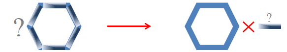
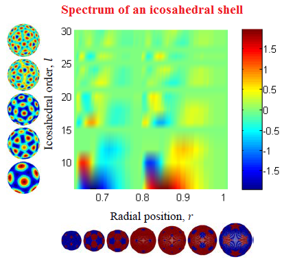
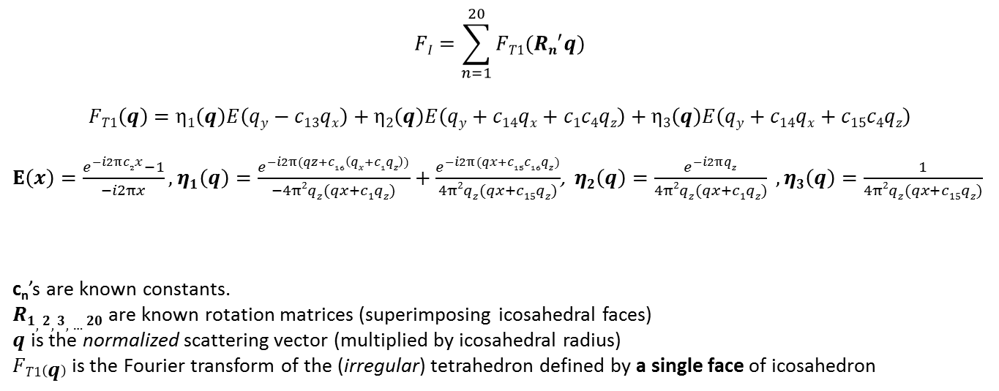

# Analytical-3D-Models-Icosahedral-Shells

Modelling the 3D geometry and density variations (texture) of an icosahedral-based object: These formulations enable one to simulate diverse 3D patterns relevant to icosahedral viruses (<i>forward</i> problem), and also form the foundations of a robust model-based reconstruction in handling experimental data (<i>inverse</i> prblem). More details:
http://arxiv.org/abs/1408.1582

 
 

<b><h2 align="center">Model-based 3D reconstruction</h1></2>
 

</img>

 
 

 

</img>

 
 

 

</img>

